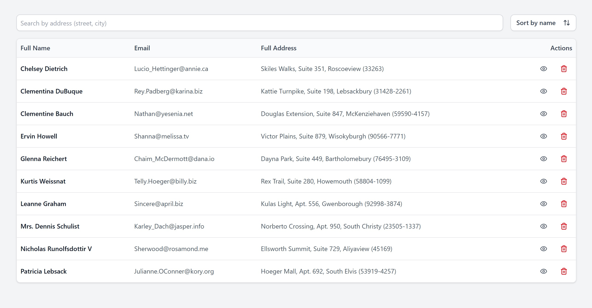
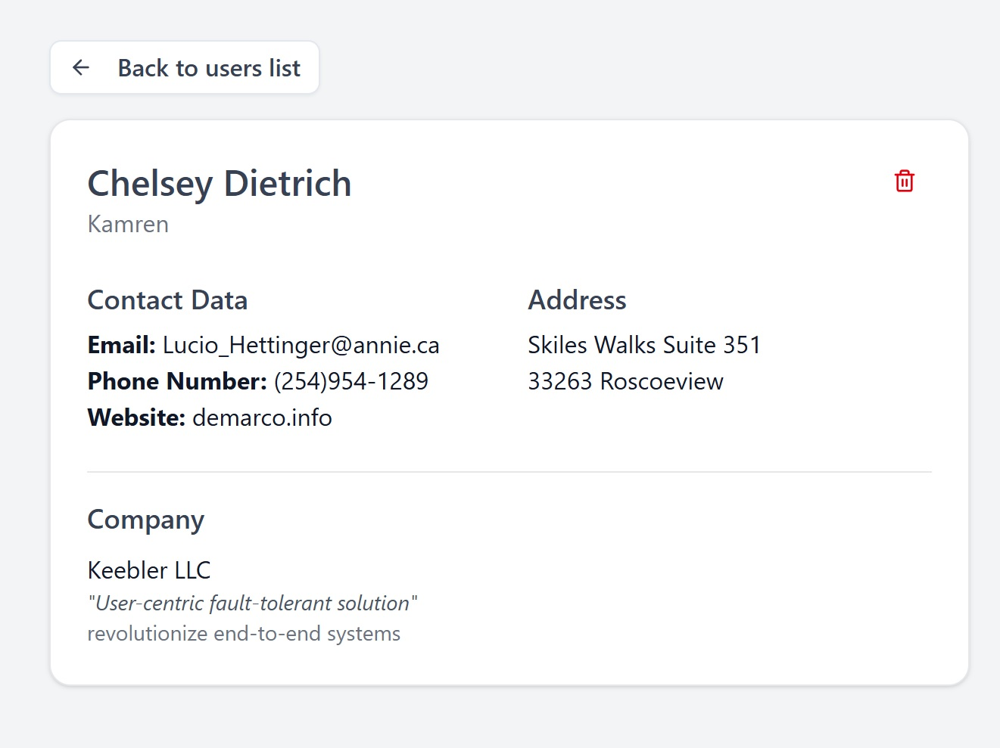
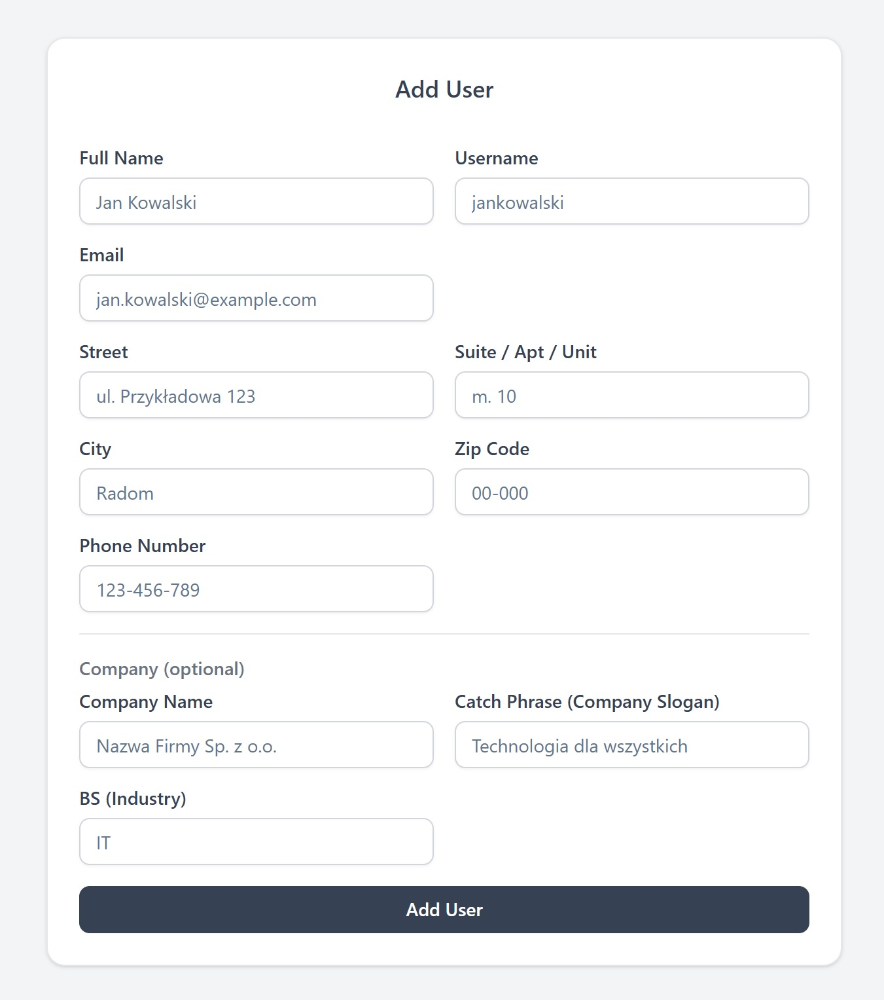

## Screenshots







## Installation

```bash
$ git clone https://github.com/danielprzybytniewski/react-task.git
$ cp .env.example .env
$ npm install
```

## Running the app

```bash
# Development mode
$ npm run dev

# Production build
$ npm run build
$ npm run preview
```
